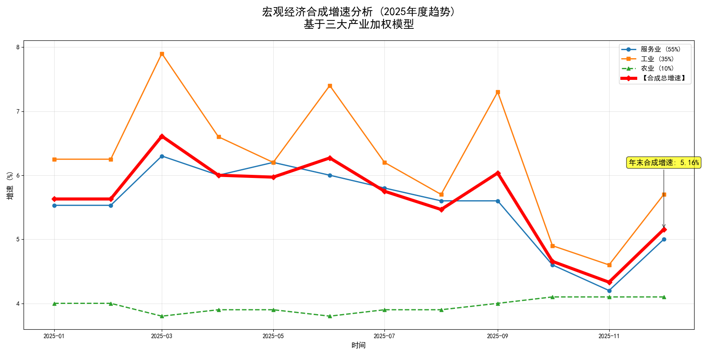
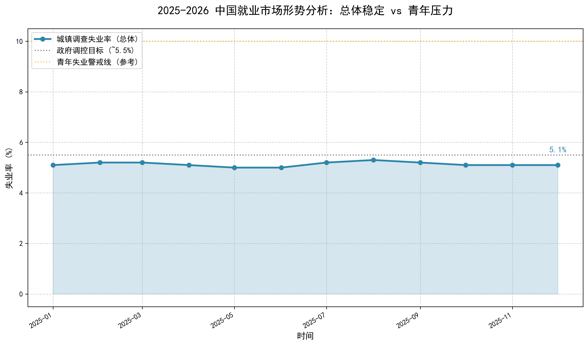
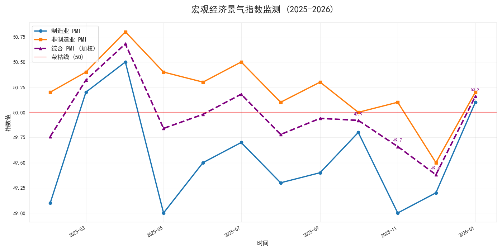
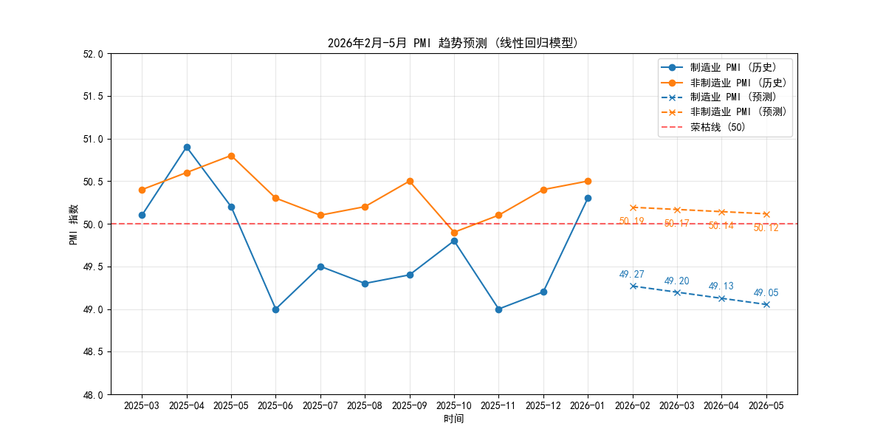

# 宏观经济分析-中华人民共和国（2025）

### 欢迎来到本人中国宏观经济分析作品集项目。本项目以2025 年中国宏观经济为专属研究对象，通过国家统计局官方应用程序接口（API） 获取原始经济数据。研究聚焦三大核心维度：经济增长，失业率分析以及经济景气度分析与预测。

# 三大体系合成经济分析

***

### 农业经济体系需按四个季度开展独立统计。在单一年度时间口径下，农业经济增速难以实现精准测算。因此，本文采用4%左右浮动值作为替代测算依据；工业与服务业经济体系则直接依据官方发布的统计数据进行核算。

### 此图的合成经济权重为：

|农业经济体系：|10%|
|工业经济体系：|55%|
|服务业经济体系：|35%|

## 结论：

- 2025年经济增长主要由工业驱动，服务业提供稳定支撑，农业贡献平稳。
- 工业增速的高波动性同时带来经济运行的不稳定性，需时刻关注外部需求变化及产能调整风险。
- 年末合成增速回落至5.16%，反映了经济动能有所减弱，需关注后续政策是否加码以稳增长。

# 失业率分析

***

### 总体失业率（5.1%–5.3%）持续高于青年失业警戒线（5.0%）。这意味着：如果青年失业警戒线是基于青年群体就业状况设定的合理上限，那么青年失业率很可能已经超过或接近5.0%。

## 结论：

- 中老年群体的失业率可能远低于总体平均水平，从而“拉低”了总体数据。换言之，青年群体的就业压力被其他群体的稳定就业所掩盖。

# 经济景气度分析

***

### 此图的综合景气指数=(制造业PMI×0.4)+(非制造业PMI×0.6)
## 结论：
- 最后的综合 PMI 在 2025 年下半年大部分时间处于 49.5 - 50.0 的临界区间。这意味着整体经济虽然没有陷入深度衰退，但增长动力不足，处于“弱复苏”或“磨底”阶段。直到 2026 年初，综合指数才重新回升 50，显示出整体经济开始进入扩张区间。

### 预测：本次实验使用线性回归算法对基于历史数据的预测分析。这一预测模型不仅基于历史数据的线性趋势延伸，更试图捕捉宏观经济在特定周期内的运行规律。如下图所示：

## 结论：
景气度可能将缓慢上升，但依然浮动或者低于50大关并且缓慢下行。依然需要政策的扶持去刺激经济发展。

# 总结
***

## 整体评估

2025年中国宏观经济呈现"弱复苏、稳中有忧"的格局。从三大核心维度来看：

| 维度 | 表现 | 风险提示 |
|------|------|----------|
| 经济增长 | 工业驱动明显，年末增速5.16% | 工业波动性带来不稳定因素 |
| 就业形势 | 总体失业率5.1%-5.3% | 青年就业压力被掩盖 |
| 景气度 | 下半年处于临界区间，年底回升 | 增长动力不足 |

## 政策建议

基于以上分析，提出以下政策建议：

1. **工业领域**：关注外部需求变化，推动产能优化调整，降低经济运行波动性
2. **就业领域**：出台青年群体专项就业扶持政策，缓解结构性就业压力
3. **景气提振**：持续加码稳增长政策，推动综合PMI稳固回升至扩张区间

## 展望

随着2026年初综合景气指数重新回升至50以上，经济开始进入扩张区间。但预计未来一段时间内，景气度仍将在50关口附近波动，需保持政策定力，持续推动经济高质量发展。

---

*报告数据来源：国家统计局官方API*
*分析方法：线性回归算法、加权合成法*
## 自此，本项目所展示部分内容结束